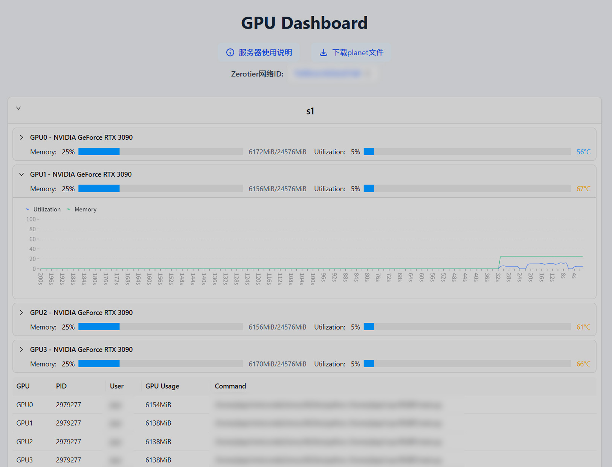
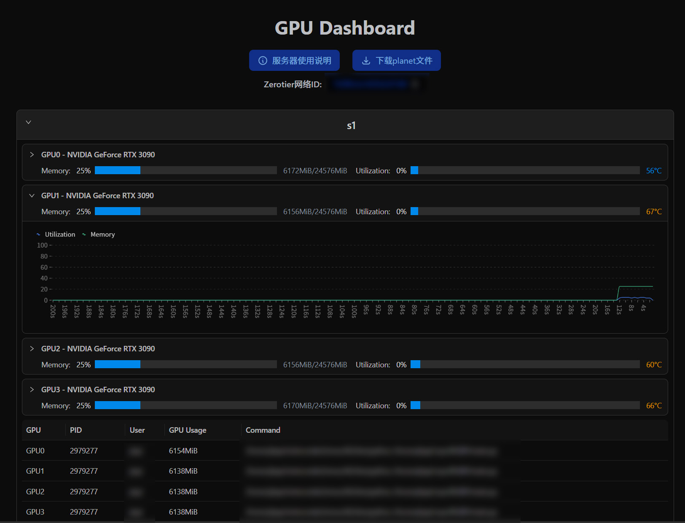

# nvidia-smi-web-dashboard

GPU monitoring dashboard for multi-server clusters, built with Next.js 14, Ant Design, and Redis. It fetches real-time GPU metrics from [agents](https://github.com/nvidia-smi-web/agent), aggregates them via a proxy API, and renders per-server and per-GPU charts with process tables.


| Light | Dark |
| --- | --- |
|  |  |

Features:
- Email verification login with JWT (optional, can be disabled)
- Redis-backed verification codes
- Access info logging (CSV)
- Proxy API to fetch multiple server statuses securely
- Responsive UI with dark mode support and smooth charts
- Dockerized production build (Next.js standalone)

## Prerequisites

- Node.js 18+ (dev) or Docker (prod)
- Redis (local or remote)
- SMTP account (if login is enabled)
- GPU agent running on your servers and exposing a status endpoint

Agent reference: run the agent first and configure `SERVERS` to point to it.


## Quick Start (Local)

1) Copy environment file `.env.example` to `.env.local` for dev and edit values
2) Install dependencies and run

```bash
npm install
npm run dev
```

3) Open http://localhost:3000


## Environment Variables

Notes:
- Prefix `NEXT_PUBLIC_` variables are exposed to the browser.
- Booleans must be the string `true` or `false`.
- Lists are comma-separated without spaces.

Core UI (public):
- `NEXT_PUBLIC_SITE_TITLE` – Site title. Default: "GPU Dashboard"
- `NEXT_PUBLIC_SITE_DESCRIPTION` – Meta description
- `NEXT_PUBLIC_NO_NEED_LOGIN` – If `true`, disables login and middleware auth
- `NEXT_PUBLIC_SERVERS_ID` – Comma-separated server IDs shown on homepage (e.g., `s1,s2`)
- `NEXT_PUBLIC_CUSTOM_ELEMENTS` – JSON array for custom top-of-page elements. See `CUSTOM_ELEMENTS_GUIDE.md`
- `NEXT_PUBLIC_CHART_DATA_LENGTH` – Samples kept in charts (default 200)

Authentication:
- `JWT_SECRET` – Secret for signing/verifying JWT tokens
- `TOKEN` – Optional simple token. If cookie `auth_token` equals this value, middleware bypasses JWT verification (useful for reverse-proxy auth)
- `DEVOPS` – Contact shown in error messages
- `ALLOWED_EMAILS` – Allowlist emails (comma-separated). Empty means all emails allowed

Server configuration:
- `SERVERS` – JSON string mapping server IDs to `{ url, token }`.
  Example (single line):
  `{"s1":{"url":"http://s1.example.com/status?process=C","token":"123456"},"s2":{"url":"http://s2.example.com/status?process=C","token":"abcdef"}}`
  The token is sent as `Authorization` header if provided.

Email (SMTP) for verification codes:
- `SMTP_HOST`, `SMTP_PORT` (587 or 465), `SMTP_SECURE` (false for 587, true for 465)
- `SMTP_USER`, `SMTP_PASS`
  If `NEXT_PUBLIC_NO_NEED_LOGIN=true`, SMTP settings aren’t required.

Redis and logging:
- `REDIS_URL` – e.g., `redis://localhost:6379` or `rediss://:<password>@host:port`
- `ACCESS_LOG_PATH` – CSV path for access logs (default `data/log/access.csv`)
- `TZ` – Server timezone for timestamps (e.g., `Asia/Shanghai`)


## Run with Docker

There are two options:

1) Docker Compose (recommended)
- Edit `.env` and `docker-compose.yml` if needed
- Mounts `./data/log` and `./data/redis`

```bash
docker compose up -d
```

2) Build image locally

```bash
docker build -t nvidia-smi-web-dashboard .
docker run --name gpu-dashboard -p 3000:3000 \
  --env-file .env \
  -e REDIS_URL=redis://host.docker.internal:6379 \
  -v $(pwd)/data/log:/app/data/log \
  -v /etc/localtime:/etc/localtime:ro \
  nvidia-smi-web-dashboard
```

The provided Dockerfile uses Next.js standalone output and starts with `node server.js` from the `.next/standalone` bundle.

### Optional: pre-run.sh hook

If you mount an executable script named `pre-run.sh` into the container at `/app`, it will be executed right before the app starts. This is useful for preparing tunnels, fetching secrets, warming caches, or any environment bootstrap you need.

- Entrypoint behavior: the container runs `sh ./pre-run.sh` if the file exists, then starts `node server.js`.
- Sample script: see `pre-run.example.sh` for an example that installs `openssh-client` (on Alpine) and creates SSH local port-forwarding tunnels.

Examples:

1) Docker run

```bash
docker run --name gpu-dashboard -p 3000:3000 \
  --env-file .env \
  -e REDIS_URL=redis://host.docker.internal:6379 \
  -v $(pwd)/data/log:/app/data/log \
  -v $(pwd)/pre-run.sh:/app/pre-run.sh:ro \
  -v $(HOME)/.ssh:/root/.ssh:ro \
  -v /etc/localtime:/etc/localtime:ro \
  nvidia-smi-web-dashboard
```

2) Docker Compose

```yaml
services:
  dashboard:
    image: do1e/nvidia-smi-web-dashboard
    # ...other options
    volumes:
      - ./pre-run.sh:/app/pre-run.sh:ro
      - ~/.ssh:/root/.ssh:ro
    # ...other options
```

Notes:
- Ensure `pre-run.sh` is executable (`chmod +x pre-run.sh`) or invoke with `sh` inside the file. The entrypoint uses `sh ./pre-run.sh` so an executable bit is not strictly required, but keeping it executable is a good practice.
- The base image is Alpine; if your pre-run requires packages, use `apk add --no-cache <pkg>` or vendor the binaries in your script.
- Long-running background tasks in `pre-run.sh` should be started with `&` so the main process can continue to `node server.js`.


## Directory Structure

```
app/
  api/
    access/route.ts         # Record access to CSV (JWT required unless disabled)
    auth/login/route.ts     # Verify email+code -> issue JWT
    auth/send-code/route.ts # Send verification code via SMTP
    proxy/route.ts          # Server-side proxy to fetch data from agents
  components/               # Per-server panels, per-GPU charts, tables, custom elements
  login/page.tsx            # Email code login page
  page.tsx                  # Homepage listing servers and charts
lib/
  accessLog.ts              # CSV appender with timezone handling
  redis.ts                  # Redis client and verification record helpers
middleware.ts               # Route protection & auth cookie check
docker-compose.yml          # Compose setup with Redis
dockerfile                  # Multi-stage build for production
```


## API Overview

- POST `/api/auth/send-code`
  - Body: `{ email: string }`
  - Sends a 6-digit code; rate-limited by Redis record (10 min expiry, 1 min cooldown)

- POST `/api/auth/login`
  - Body: `{ email: string, code: string }`
  - Validates code, returns `{ token }` (JWT, 30d expiry). Frontend stores in `auth_token` cookie

- POST `/api/access`
  - Headers: Cookie `auth_token`
  - Appends a CSV line: `email,access_time,ip_address`

- POST `/api/proxy`
  - Body: `{ serverId: string | string[] }`
  - Server-side fetch from `SERVERS[serverId].url` with optional `Authorization` header
  - Returns agent JSON or error code


## Security Notes

- Never commit real SMTP credentials, JWT secrets, or `SERVERS`
- Keep `NEXT_PUBLIC_NO_NEED_LOGIN=false` and configure SMTP & `ALLOWED_EMAILS` if don't want to expose publicly
- Optionally set `TOKEN` when your reverse proxy injects a fixed trusted cookie value


## License

Apache 2.0 License

---
Feel free to open issues or PRs for enhancements.

